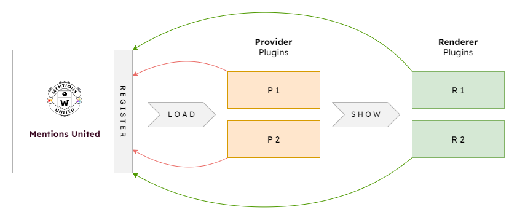
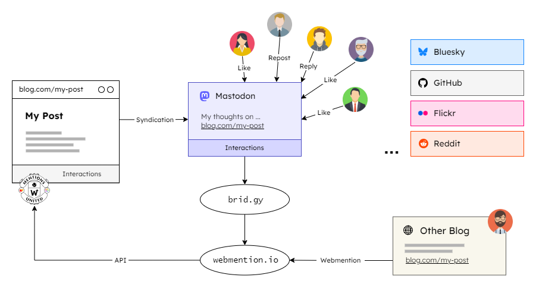
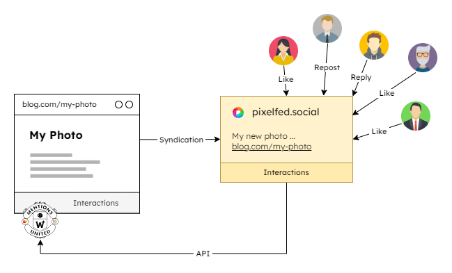
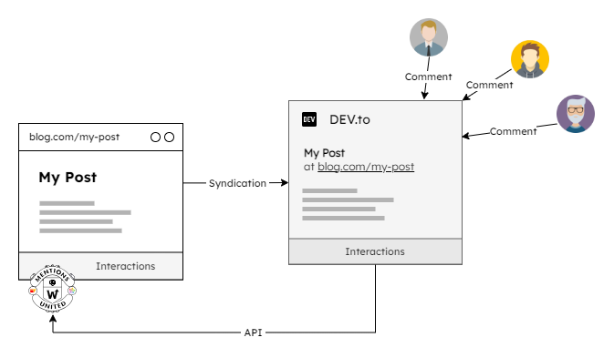
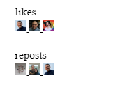
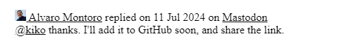
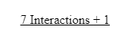
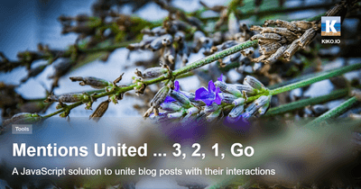

<p align="center">
  
</p>

# Mentions United

**Client-side fetching and rendering of interactions from the web**

A blog post is usually the starting point for a conversation with readers, but this is often not reflected on the post page itself, if you don't rely on your own local comment function. Wordpress bloggers and tech-savvy bloggers connect their site to the [Fediverse](https://en.m.wikipedia.org/wiki/Fediverse) via a [plugin](https://wordpress.org/plugins/activitypub/) or directly over the [ActivityPub](https://en.m.wikipedia.org/wiki/ActivityPub) protocol and all interactions with it, such as comments, likes and reposts, will be displayed automatically below the actual article. This is made possible by reactive components on the web server, which are missing in static blogs built with 11ty, Jekyll, Hugo, Gatsby, Hexo and other **Static Site Generators** (SSG). In this case, the article is often syndicated by hand for distribution, for example as a post with a link to the article on a Fediverse platform such as Mastodon or Pixelfed, but also on others such as DEV.to or Flickr. **POSSE** - Publish on your site and syndicate elsewhere ...

The aim of this project is to bring these syndications back to the article page via the respective **API's** of the platforms using vanilla **JavaScript, without any dependencies**.

The scripts involved are executed in the client (browser) when the reader calls up the page or a button is pressed. This has two advantages over the approach of fetching and caching interaction during the build of the website:

- the interactions are immediately visible and the operator does not have to build his page regularly
- if a user decides to withdraw an interaction on the platform, it is immediately no longer displayed on the article page, unless the platform still has it in its cache

## Overview

**Mentions United** is a plugin system with a main script and two types of **plugin scripts** that can be registered there:

- **Provider**  
Retrieves interactions by a key of the page (URL of syndication, ID or whatever) from a specific platform via a RESTful API and transfers them into a common form

- **Renderer**  
Generates HTML from all interactions collected by the providers and inserts it into the page



The general procedure is as follows ... see section 'Usage' for more details:

1. all required scripts are included on the page via `script` tags
2. the main script is initialized with its settings
3. the main method `register` is called for each plugin to register it with the required options
4. the main method `load` is called to instruct all Provider plugins to fetch the data
5. the main method `show` is called afterwards to instruct all Renderer plugins to generate the HTML for all retrieved interactions and insert it into the page

The system currently offers 3 Provider plugins and 3 Renderer plugins (see sections below) and more are planned. But it is definitely open for new plugins from the community. **It would therefore be absolutely fantastic if you would write your own plugin and make it available to all other users here via a pull request!**

## Main Script

The main script [**`mentions-united.js`**](https://github.com/kristofzerbe/Mentions-United/blob/main/mentions-united.js) is the central hub of the system and is implemented as a class. It contains the basic structure of the plugins, the common definition of an interaction and the main methods for fetching and displaying the interactions.

### Provider and Renderer Class

The nested static classes **`Provider`** and **`Renderer`** are the basic structures from which the plugin implementations **must extend** from. The only technical reason for this is to identify the correct plugin type during registration. You can find more information on how they are structured in the respective section below.

### Interaction Class

The nested static class **`Interaction`** represents an interaction across all plugins and contains all necessary information:

|                     | Description                                                                   |
| ------------------- | ----------------------------------------------------------------------------- |
| **type**            | Type verb of the interaction, e.g. comment, like, reply, repost, mention, ... |
| **received**        | Date the interaction was created or received                                  |
| source.**provider** | Pick-up point of the interaction                                              |
| source.**origin**   | Origin system of the interaction                                              |
| source.**sender**   | Transfer system of the interaction                                            |
| source.**url**      | URL of the original interaction                                               |
| source.**id**       | ID of the original interaction (if available and needed)                      |
| source.**title**    | Title of the original interaction (if available and needed)                   |
| author.**name**     | Author's name of the interaction                                              |
| author.**avatar**   | Author's avatar image URL of the interaction                                  |
| author.**profile**  | Author's profile URL of the interaction (if available and needed)             |
| content.**html**    | Text of the interaction as HTML (if available and needed)                     |
| content.**text**    | Raw text of the interaction (if available and needed)                         |

### Main Methods

In the constructor of the main class, in addition to the settings, an array of plugin classes to be registered can also be provided, which calls the first of the three main methods **``register(plugin)``** that has to be used to make a plugin available to the system.

The second main method is **`load()`**, which in turn calls the `retrieve()` method in all registered Provider plugins to fetch the interaction data. The interactions in the array returned by the plugin are then finally processed, for example to ensure that each interaction contains an author name and an avatar image or to determine, by using the `ownerName` setting, whether an interaction originates from the creator, so that it can be handled differently later when it is displayed. Finally, the interactions are sorted by received date in descending order.

The third main method called **`show()`** runs through all Renderer plugins and invokes the `render(interactions)` method there, to insert the interactions into the calling page.

### Helper Class

The nested static class **`Helper`** defines small methods as tools that all plugins can use ... freely according to the DRY principle.

### Settings

The object **`settings`** are the mandatory information that must be provided when the main script is instantiated:

|               | Type   | Description                                                                                                                                            |
| ------------- | ------ | ------------------------------------------------------------------------------------------------------------------------------------------------------ |
| **ownerName** | String | Full name of the creator of the web page for which interactions may have taken place. In the case of a personal blog, this is mostly the owner's name. |

### Initialization

```html
<script src="/js/mentions-united.js"></script>
```

```js
const mentionsUnited = new MentionsUnited({
  ownerName: "__YOUR-NAME__"
});
```

## Provider Plugins

A Provider plugin fetches all interactions from a specific platform using the given options and brings them into the common form of a `MentionsUnited.Interaction`.

The implementation of a Provider plugin is a class which extends from ``MentionsUnited.Provider``. It has the following mandatory basic structure, which can be expanded to include further elements as required:

|                              | Type          | Description                                              |
| ---------------------------- | ------------- | -------------------------------------------------------- |
| **key = "";**                | Public Field  | Unique key across all renderer plugins for registration  |
| **options = {};**            | Public Field  | Pptions for the plugin                                   |
| **constructor(options) {};** | Constructor   | Constructor that takes the needed options                |
| **async retrieve() {};**     | Public Method | Async main method to retrieve interactions from provider |

The following Provider plugins are currently available:

### Webmentions

*File: [mentions-united-provider_webmentions.js](https://github.com/kristofzerbe/Mentions-United/blob/main/mentions-united-provider_webmentions.js)*  
*Version: 1.0.0*  
*Author: [Kristof Zerbe](https://github.com/kristofzerbe)*  

This plugin fetches its data from [Aaron Parecki's](https://github.com/aaronpk) **[webmention.io](https://webmention.io/)**, which can be used on a static page as a [Webmention](https://en.wikipedia.org/wiki/Webmention) endpoint.

[Ryan Barret's](https://github.com/snarfed) **[Bridgy](https://brid.gy/)** can also be used to collect interactions from platforms such as **Mastodon**, **Bluesky**, **Flickr**, **Reddit** and **GitHub** on webmention.io. If you have been using this service combination for a while, there may still be interactions from Twitter, Facebook and Google Plus, but these are no longer supported by Bridgy.



#### Specials

If the target URL is a Webmention (`source.origin` = ‘web’), i.e. another blogger has mentioned your page and sent a Webmention that was received at the webmention.io endpoint, you can set in the options that the plugin tries to fetch the **title of the post** mentioned. This usually looks a bit nicer when displayed than a pure URL.

Mastodon, among others, allows users to use **emojis** in their user name. These are automatically resolved by the plugin via the respective instance as an URL to a PNG image.

This plugin is so far the only one that distinguishes between ``source.provider`` and ``source.sender``. For Webmentions the sender is the mentioning blog and for interactions from Mastodon and the other platforms it is Bridgy.

#### Options

|                     | Type    | Description                                                |
| ------------------- | ------- | ---------------------------------------------------------- |
| **targetUrl**       | String  | Full URL of the page mentioned (Permalink of current page) |
| \[tryResolveTitle\] | Boolean | Should titles of mentioning pages be resolved              |

#### Supported Origins

- web (native)
- mastodon (via Bridgy)
- bluesky (via Bridgy)
- flickr (via Bridgy)
- github (via Bridgy)
- reddit (via Bridgy)
- twitter (via Bridgy, discontinued)
- facebook (via Bridgy, discontinued)
- googleplus (via Bridgy, discontinued)

#### Supported Type Verbs

- reply
- like
- repost
- bookmark
- mention

#### Initialization

```html
<script src="/js/mentions-united-provider_webmentions.js"></script>
```

```js
mentionsUnited.register(new MentionsUnitedProvider_Webmentions({
  targetUrl: "__PAGE-URL__",
  tryResolveTitle: true
}));
```

### Pixelfed

*File: [mentions-united-provider_pixelfed.js](https://github.com/kristofzerbe/Mentions-United/blob/main/mentions-united-provider_pixelfed.js)*  
*Version: 1.0.0*  
*Author: [Kristof Zerbe](https://github.com/kristofzerbe)*  

This plugin fetches its data from a [Pixelfed](https://pixelfed.org/) instance.



#### Specials

Pixelfed has a total of three API endpoints via which interactions have to be requested: *Favoured*, *Reblogged* and *Context* for replies. These are called up concurrently and then merged.

#### Options

|                          | Type   | Description                                                   |
| ------------------------ | ------ | ------------------------------------------------------------- |
| **sourceUrl**            | String | Full URL of the mentioning page on Pixelfed                   |
| \[apiBaseUrl\]       | String | Base URL of API proxy, if existing                            |
| \[apiTokenReadOnly\] | String | Token to access Pixelfed's API in Read-Only mode, if no proxy |

For Pixelfed instances, you must specify an **authentication token** when accessing the **public API**, which you can create in the Pixelfed settings under ‘Applications’. Only one with read-only rights is required.

In the plugin options you can either enter the token **directly** (if you don't care that anyone can use it to read your public Pixelfed data) or you can enter the base URL of an **API proxy** through which the Pixelfed requests are passed.

In case you use the token in the options directly, the ``apiBaseUrl`` is taken automatically from the ``sourceUrl``.

If you want to use the proxy option, you can find a suitable Node.js web application, made for this project, under **[Mentions United API-Proxy](https://github.com/kristofzerbe/Mentions-United-API-Proxy)**. You only need to find a suitable hoster for it, such as [Railway](https://railway.app) or the like.

#### Supported Origins

- pixelfed

#### Supported Type Verbs

- like
- repost
- reply

#### Initialization

```html
<script src="/js/mentions-united-provider_pixelfed.js"></script>
```

```js
mentionsUnited.register(new MentionsUnitedProvider_Pixelfed({
  sourceUrl: "__PIXELFED-URL__",
  apiBaseUrl: "__PROXY-BASE_URL__"
}));
```

### DEV.to

*File: [mentions-united-provider_devto.js](https://github.com/kristofzerbe/Mentions-United/blob/main/mentions-united-provider_devto.js)*  
*Version: 1.0.0*  
*Author: [Kristof Zerbe](https://github.com/kristofzerbe)*  

This plugin fetches comments from the development platform [DEV.to](https://dev.to/), if you also publish your posts there.



#### Specials

DEV stores the comment data in nested form as a tree. The plugin flattens this data to one single level.

Unfortunately, the reactions such as *Like*, *Unicorn*, *Exploding Head*, *Raised Hands* or *Fire* cannot be called up as individual interactions via the API, but only as a total number, which has been omitted in this plugin.

#### Options

|                | Type   | Description                                    |
| -------------- | ------ | ---------------------------------------------- |
| **sourceUrl**  | String | URL of the mentioning page on dev.to           |
| \[sourceId\]   | Number | ID of dev.to article (only available over API) |

#### Supported Origins

- devto

#### Supported Type Verbs

- comment

#### Initialization

```html
<script src="/js/mentions-united-provider_devto.js"></script>
```

```js
mentionsUnited.register(new MentionsUnitedProvider_DevTo({
  sourceUrl: "__DEVTO-URL__"
}));
```

## Renderer Plugins

A Renderer plugin takes an array of `MentionsUnited.Interaction`, collected by the Provider plugins, and generates HTML out of it and inserts it into the page. This HTML should then be styled as desired using CSS, as the plugin itself does not provide any styles.

The implementation of a Renderer plugin is a class which extends from ``MentionsUnited.Renderer``. It has the following mandatory basic structure, which can be expanded to include further elements as required:

|                              | Type          | Description                                             |
| ---------------------------- | ------------- | ------------------------------------------------------- |
| **key = "";**                | Public Field  | Unique key across all renderer plugins for registration |
| **options = {};**            | Public Field  | Options for the plugin                                  |
| **constructor(options) {};** | Constructor   | Constructor that takes the needed options               |
| **render(interactions) {};** | Public Method | Main method to render interactions via templates        |

The following Renderer plugins are currently available:

### Avatars By Type

*File: [mentions-united-renderer_avatars-by-type.js](https://github.com/kristofzerbe/Mentions-United/blob/main/mentions-united-renderer_avatars-by-type.js)*  
*Version: 1.0.0*  
*Author: [Kristof Zerbe](https://github.com/kristofzerbe)*  

This plugin creates an inline list of avatars of a specific interaction type. It can be used multiple times on a page to display interactions of different types. For this purpose, the ``key`` of the plugin for registration in the main script is extended with the ``typeVerb`` given by the options.

#### Options

|                   | Type     | Description                                                          |
| ----------------- | -------- | -------------------------------------------------------------------- |
| **placeholderId** | String   | ID of the element which will be replaced by the generated HTML       |
| **typeVerb**      | String   | Type verb for filtering the interactions and to show as avatars      |
| \[afterRender\]   | Callback | Function to call after the generated HTML was inserted into the page |

#### Rendered HTML

```html
<div class="interactions-avatars type-TYPE">
  <h3>TYPE</h3>
  <a class="avatar origin-SOURCE.ORIGIN" 
     href="AUTHOR.PROFILE" title="AUTHOR.NAME on SOURCE.ORIGIN">
    
  </a>
   ... more
</div>
```

#### Example (unstyled)



### List

*File: [mentions-united-renderer_list.js](https://github.com/kristofzerbe/Mentions-United/blob/main/mentions-united-renderer_list.js)*  
*Version: 1.0.0*  
*Author: [Kristof Zerbe](https://github.com/kristofzerbe)*  

This plugin creates a list of all interactions. Depending on the type, different meta and/or content data are generated.

The ``skipTypes`` option can be used to filter out unwanted interactions by type, for example because they have already been inserted into the page as an avatar list

#### Options

|                   | Type   | Description                                                    |
| ----------------- | ------ | -------------------------------------------------------------- |
| **placeholderId** | String | ID of the element which will be replaced by the generated HTML |
| \[skipTypes\]     | String | Comma-separated list of type-verbs to skip                     |

#### Rendered HTML

```html
<!-- TYPE = reply -->
<div class="interaction origin-mastodon type-reply">
  <a class="avatar" href="AUTHOR.PROFILE">
    
  </a>
  <span class="meta">
    <a class="author" href="AUTHOR.PROFILE">AUTHOR.NAME</a>
    <span class="type">type-TYPEWORD</span>
    <span class="prep">on</span>
    <span class="received">RECEIVED</span>
    <span class="prep">on</span>
    <a href="SOURCE.URL" class="origin">SOURCE.ORIGIN</a>
  </span>
  <div class="content">
    CONTENT.HTML
  </div>
  ... more
</div>
```

#### Example (unstyled)



### Total Number

*File: [mentions-united-renderer_total-number.js](https://github.com/kristofzerbe/Mentions-United/blob/main/mentions-united-renderer_total-number.js)*  
*Version: 1.0.1*  
*Author: [Kristof Zerbe](https://github.com/kristofzerbe)*  

This plugins creates a single HTML element showing the total number of received Interactions. It can be created as an anchor to be able to jump to another page element on click, such as the list of interactions or similar.

By specifying a ``pageKey`` in the options, the total number can be temporarily stored in the Local Storage of the browser in order to display a delta number the next time the page is visited.

#### Options

|                    | Type     | Description                                                          |
| ------------------ | -------- | -------------------------------------------------------------------- |
| **placeholderId**  | String   | ID of the element which will be replaced by the generated HTML       |
| \[pageKey\]        | String   | Unique identifier of the page, e.g. slug, for caching feature        |
| \[anchorTargetId\] | String   | ID of the element to jump to on click for rendering as anchor        |
| \[afterRender\]    | Callback | Function to call after the generated HTML was inserted into the page |

#### Rendered HTML

```html
<a href="#ANCHORTARGETID" class="interactions-totalnumber">
  <span>COUNT Interactions</span>
  <span class="delta">+/- DELTA</span>
</a>
```

#### Example (unstyled)



## Install

There is no installation routine for the scripts. Simply copy the main script and all needed plugin scripts into the folder of your project where the other JavaScript files are located.

## Demo & Usage

There is no real demo for **Mentions United**, but it was developed for the blog **[kiko.io](https://kiko.io)** and you can see what it can look like in the posts and notes there ... if there are some interactions ;)

It is very easy to integrate into your own pages. You just have to follow a certain order:

1. Integration of the main script and the desired plugin scripts into the HTML:

```html
<script src="/js/mentions-united.js"></script>
<script src="/js/mentions-united-provider_webmentions.js"></script>
<script src="/js/mentions-united-renderer_list.js"></script>
```

2. Initialization of the main script with the required options in a subsequent script block or in a separate script:

```js
window.addEventListener('load', function () {

  const mentionsUnited = new MentionsUnited({ 
    ownerName: "Alice Example" 
  });

}
```

3. Registration of all needed plugin scripts:

```js
... 

mentionsUnited.register(new MentionsUnitedProvider_Webmentions({
  targetUrl: "https://alice.example.com/blog/my-post",
  tryResolveTitle: true
}));

mentionsUnited.register(new MentionsUnitedRenderer_List({
  placeholderId: "interactions-list-placeholder"
}));

...
```

4. Execution of the main methods

```js
...

mentionsUnited.load()
  .then(() => {
    return mentionsUnited.show();
  })
  .then((count) => {
    // ...
  });

...
```

## More Information

Here you will find an introductory article that describes how **Mentions United** can be implemented under the SSG Hexo:

[](https://kiko.io/post/Mentions-United-3-2-1-go/)
